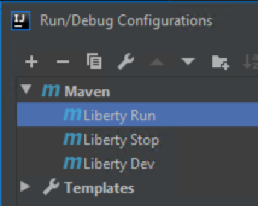

//  Copyright (c) 2017, 2019 IBM Corporation and others.
// Licensed under Creative Commons Attribution-NoDerivatives
// 4.0 International (CC BY-ND 4.0)
//   https://creativecommons.org/licenses/by-nd/4.0/
//
// Contributors:
//     IBM Corporation
//
:projectid: IntelliJ
:page-layout: guide-multipane
:page-duration: 30 minutes
:page-releasedate: 2019-12-03
:page-guide-category: microprofile
:page-essential: true
:page-essential-order: 1
:page-description: Learn how to create a REST service with JAX-RS, JSON-B, and Open Liberty with IntelliJ.
:guide-author: Open Liberty
:page-tags: ['MicroProfile', 'Java EE', 'Jakarta EE', 'IntelliJ']
:page-related-guides: ['rest-client-java', 'rest-client-angularjs', 'rest-intro']
:page-permalink: /guides/{projectid}
:repo-description: Visit the https://openliberty.io/guides/{projectid}.html[website] for the rendered version of the guide.
:common-includes: https://raw.githubusercontent.com/OpenLiberty/guides-common/master
:icons: font

= Creating a RESTful web service with IntelliJ

[.hidden]
NOTE: This repository contains the guide documentation source. To view the guide in published form, view it on the https://openliberty.io/guides/{projectid}.html[Open Liberty website].

Learn how to create a REST service with JAX-RS, JSON-B, and Open Liberty with IntelliJ.

== What you'll learn

You will learn how to get started with IntelliJ by building and testing a simple REST service using JAX-RS and JSON-B, which will expose
the JVM's system properties. The REST service will respond to `GET` requests made to the `\http://localhost:9080/LibertyProject/System/properties` URL.

The service responds to a `GET` request with a JSON representation of the system properties, where
each property is a field in a JSON object like this:

[source,json,role="no_copy"]
----
{
  "os.name":"Mac",
  "java.version": "1.8"
}
----

When you create a new REST application, the design of the API is important. The JAX-RS APIs can be
used to create JSON-RPC, or XML-RPC APIs, but it wouldn't be a RESTful service. A good RESTful service
is designed around the resources that are exposed, and on how to create, read, update, and delete the
resources.

The service responds to `GET` requests to the `/System/properties` path. The `GET` request should
return a `200 OK` response that contains all of the JVM's system properties.

== Installing and configuring IntelliJ

If IntelliJ isn't installed, download and install it on your machine. The free community edition should suffice for this
guide.

include::{common-includes}/os-tabs.adoc[]

[.tab_content.windows_section]
--
https://www.jetbrains.com/idea/download/#section=windows[^]
--

[.tab_content.mac_section]
--
https://www.jetbrains.com/idea/download/#section=mac[^]
--

[.tab_content.linux_section]
--
https://www.jetbrains.com/idea/download/#section=linux[^]

--

== Getting started

Launch IntelliJ and select `Get from Version Control` and paste the following in the `URL` field:
`https://github.com/meswan/guide-IntelliJ.git[^]` and select `Clone`.


IMPORTANT: Make a note of the directory path that the project is being cloned to.


When prompted if you would like to create a project, select `Yes`. On the `Import Project` dialog, choose `Import
Project from external model`, select `Maven` and click on `Finish`.

You should see a progress bar indicating the status of the operation. Click on `Open` on the welcome screen and
navigate to the directory that the project was saved and select `Ok`. On the top left hand side of the screen,
expand the `guide-{projectid}` project.


The `start` directory contains the starting project that you will build upon.

The `finish` directory contains the finished project that you will build.

NOTE: At the bottom right of the IDE, click on `Terminal` to bring up the console if needed. By default, it should start
in the `guide-{projectid}` directory.

== Configure the build project
TODO:


=== Try what you'll build

The `finish` directory in the root of this guide contains the finished application. Give it a try before you proceed.

To try out the application, first go to the `finish` directory and run the following Maven
goal to build the application and deploy it to Open Liberty:
[role='command']
```
mvn liberty:run
```

Check out the service at the
http://localhost:9080/LibertyProject/System/properties[^] URL.

After you are done checking out the application, stop the Open Liberty server by pressing `CTRL+C`
in the shell session where you ran the server. Alternatively, you can run the `liberty:stop` goal
from the `finish` directory in another shell session:

[role='command']
```
mvn liberty:stop
```

== Creating a JAX-RS application

Navigate to the `start` directory to begin.

Start Open Liberty in development mode, which starts the Open Liberty server and listens
for file changes:

[role="command"]
```
mvn liberty:dev
```


JAX-RS has two key concepts for creating REST APIs. The most obvious one is the resource itself, which is
modelled as a class. The second is a JAX-RS application, which groups all exposed resources under a
common path. You can think of the JAX-RS application as a wrapper for all of your resources.


[role="code_command hotspot" ,subs="quotes"]
----
#Replace the `SystemApplication` class.#
`src/main/java/io/openliberty/guides/rest/SystemApplication.java`
----

The [hotspot=systemApplication]`SystemApplication` class extends the `Application` class, which in turn associates all JAX-RS
resource classes in the WAR file with this JAX-RS application, making them available under the common
path specified in the [hotspot=systemApplication]`SystemApplication` class. The [hotspot=applicationPath]`@ApplicationPath` annotation has a
value that indicates the path within the WAR that the JAX-RS application accepts requests from.

SystemApplication.java
[source, Java, linenums, role='code_column hide_tags=comment']
----
include::finish/src/main/java/io/openliberty/guides/rest/SystemApplication.java[]
----

== Creating the JAX-RS resource

In JAX-RS, a single class should represent a single resource, or a group of resources of the same type.
In this application, a resource might be a system property, or a set of system properties. It is easy
to have a single class handle multiple different resources, but keeping a clean separation between types
of resources helps with maintainability in the long run.

[role="code_command hotspot", subs="quotes"]
----
#Create the `PropertiesResource` class.#
`src/main/java/io/openliberty/guides/rest/PropertiesResource.java`
----

This resource class has quite a bit of code in it, so let's break it down into manageable chunks.

The [hotspot=path file=0]`@Path` annotation on the class indicates that this resource responds to the `properties` path
in the JAX-RS application. The [hotspot=applicationPath file=1]`@ApplicationPath` annotation in the [hotspot=systemApplication file=1]`SystemApplication` class together with
the [hotspot=path file=0]`@Path` annotation in this class indicates that the resource is available at the `System/properties`
path.

JAX-RS maps the HTTP methods on the URL to the methods on the class. The method to call is determined
by the annotations that are specified on the methods. In the application you are building, an HTTP `GET` request
to the `System/properties` path results in the system properties being returned.

The [hotspot=get file=0]`@GET` annotation on the method indicates that this method is to be called for the HTTP `GET`
method. The [hotspot=produces file=0]`@Produces` annotation indicates the format of the content that will be returned. The
value of the [hotspot=produces file=0]`@Produces` annotation will be specified in the HTTP `Content-Type` response header.
For this application, a JSON structure is to be returned. The desired `Content-Type` for a JSON
response is `application/json` with `MediaType.APPLICATION_JSON` instead of the `String` content type. Using a constant such as `MediaType.APPLICATION_JSON` is better because if there's a spelling error, a compile failure occurs.

JAX-RS supports a number of ways to marshal JSON. The JAX-RS 2.1 specification mandates JSON-Binding
(JSON-B) and JAX-B.

The method body returns the result of `System.getProperties()` that is of type `java.util.Properties`. Since the method
is annotated with `@Produces(MediaType.APPLICATION_JSON)`, JAX-RS uses JSON-B to automatically convert the returned object
to JSON data in the HTTP response.

PropertiesResource.java
[source,java,linenums,role='code_column hide_tags=comment']
----
include::finish/src/main/java/io/openliberty/guides/rest/PropertiesResource.java[]
----

SystemApplication.java
[source,java,linenums,role='code_column hide_tags=comment']
----
include::finish/src/main/java/io/openliberty/guides/rest/SystemApplication.java[]
----

== Configuring the server

To get the service running, the Liberty server needs to be correctly configured.

[role="code_command hotspot", subs="quotes"]
----
#Replace the server configuration file.#
`src/main/liberty/config/server.xml`
----

server.xml
[source,xml,linenums,role="code_column"]
----
include::finish/src/main/liberty/config/server.xml[]
----

The configuration does the following actions:

. Configures the server to enable JAX-RS. This is specified in the [hotspot=featureManager file=0]`featureManager` element.
. Configures the server to resolve the HTTP port numbers from variables, which are then specified in
the Maven [hotspot=defaultHttpPort hotspot=defaultHttpsPort file=1]`pom.xml` file. This is specified in the [hotspot=httpEndpoint file=0]`<httpEndpoint/>` element. Variables use the `${variableName}` syntax.
. Configures the server to run the produced web application on a context root specified in the
[hotspot=appContextRoot file=1]`pom.xml` file. This is specified in the [hotspot=webApplication file=0]`<webApplication/>` element.

pom.xml
[source,xml,linenums,role="code_column"]
----
include::finish/pom.xml[]
----

The variables that are being used in the [hotspot=httpEndpoint hotspot=webApplication file=0]`server.xml` file are provided by the properties set in the Maven [hotspot=defaultHttpPort hotspot=defaultHttpsPort hotspot=appContextRoot file=1]`pom.xml` file. The properties must be formatted as `liberty.var.variableName`.

== Building and running the application

The Open Liberty server was started in development mode at the beginning of the guide and all the
changes were automatically picked up.

Check out the service that you created at the
http://localhost:9080/LibertyProject/System/properties[^] URL.


// Skipping "Testing the service" section as the guide would be too lengthy.


== Great work! You're done!

You developed a REST service in Open Liberty by using JAX-RS and JSON-B in IntelliJ.

== Related Links

Learn more about MicroProfile.

https://microprofile.io/[See the MicroProfile specs^]

https://openliberty.io/docs/ref/microprofile[View the MicroProfile API^]


include::{common-includes}/attribution.adoc[subs="attributes"]
